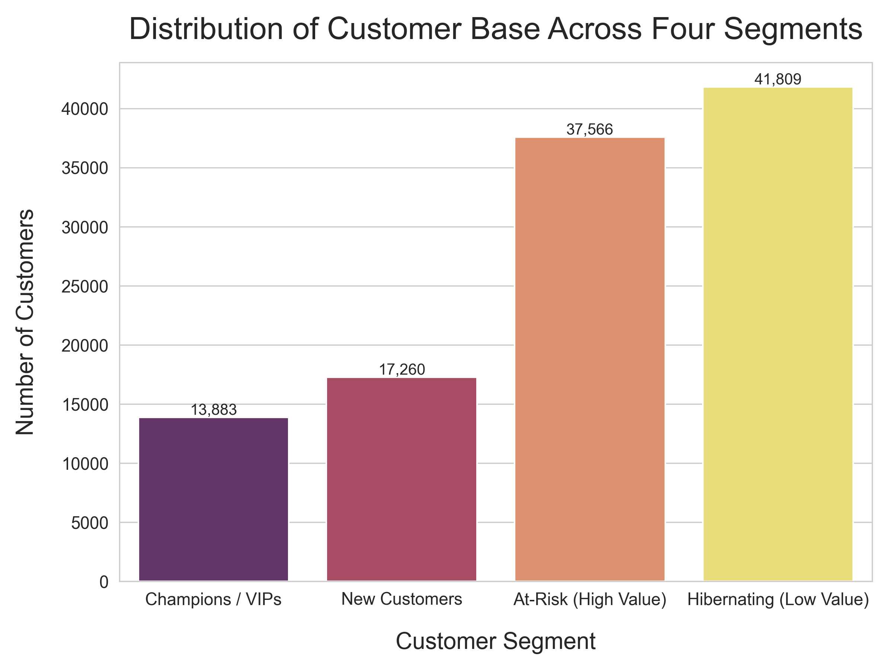
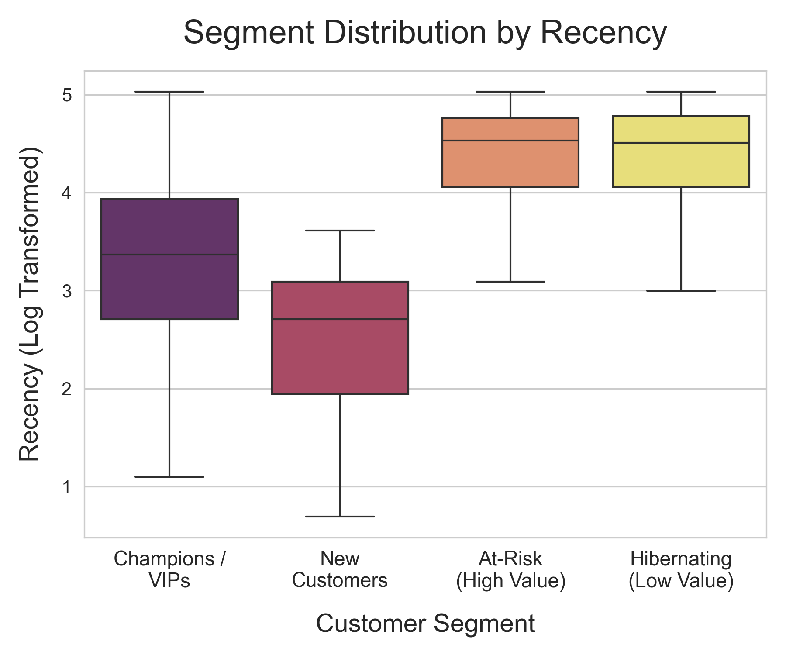
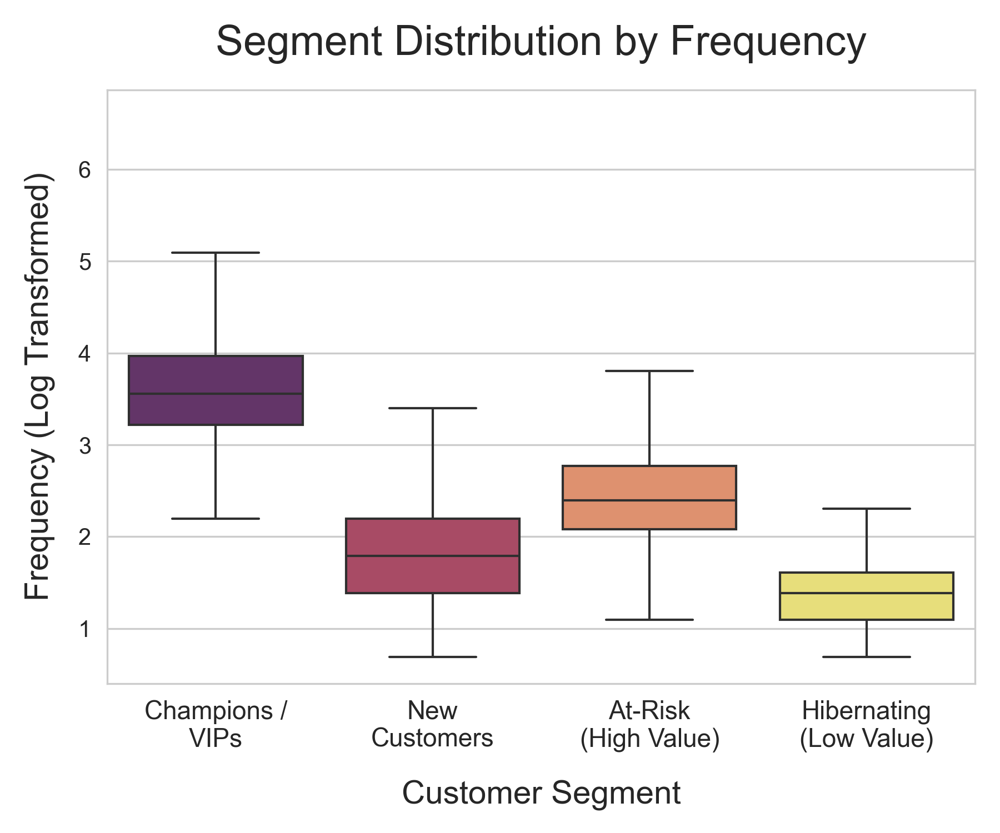
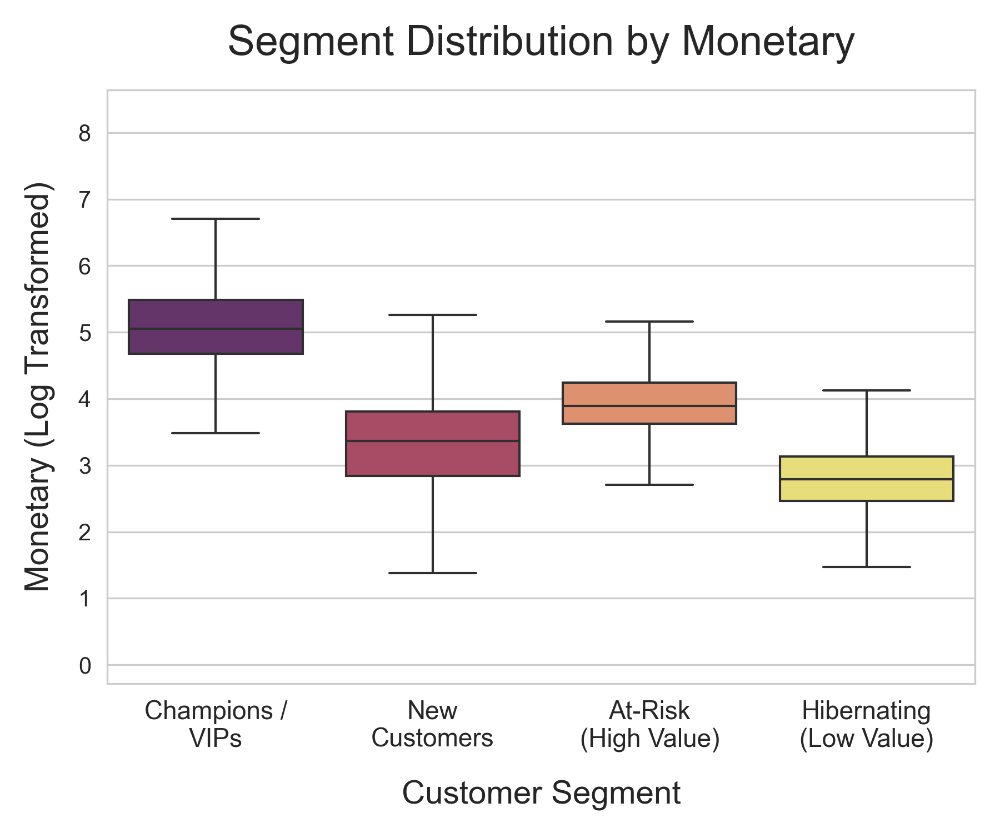

# 📊 E-Commerce Customer Segmentation Analysis

## Project Overview

This project tackles a common business problem—the "**Leaky Bucket**" scenario in e-commerce—by identifying high-value customers who are becoming inactive. The objective is to deploy **targeted retention strategies** to save revenue. The analysis utilizes a substantial, real-world e-commerce transaction dataset to segment the customer base, providing a clear, actionable strategic roadmap designed to maximize **Customer Lifetime Value (CLV)**.

---

## Key Findings:

* The customer base was successfully partitioned into **four distinct strategic segments**: Champions, New Customers, At-Risk, and Hibernating.
* The **At-Risk (High Value)** segment was prioritized for an **Aggressive Win-Back** intervention, demanding immediate strategic focus.
* Specific, data-driven tactics were created for each segment to optimize marketing spend and resource allocation.

---

## 📦 Project Deliverables

This repository contains two primary documents that serve the technical and business objectives of the analysis:

1.  **Business Strategy Report**
    * The **[`Customer Segmentation Report.pdf`](<./Customer Segmentation Report.pdf>)** is the executive summary and strategic deliverable.
    * It outlines the methodology, presents the final segmented profiles, and details the specific, data-driven tactics for customer retention and growth.
2.  **Analytical Code**
    * The **[`ECommerce_Customer_Segmentation.ipynb`](./ECommerce_Customer_Segmentation.ipynb)** file contains the full analytical pipeline, including data preparation, RFM feature engineering, Log-transformation, K-Means clustering implementation, and the generation of all supporting visualizations.

---

## Data Source and Setup

To successfully run and replicate this analysis, the raw data must be downloaded and placed in the project directory.

* **Data Acquisition:** The required dataset should be obtained from the original public source.
    * **Source:** [Kaggle: eCommerce Events History](https://www.kaggle.com/datasets/mkechinov/ecommerce-events-history-in-cosmetics-shop)
* **File Preparation:** Extract the **five individual CSV files** from the downloaded compressed archive.
* **File Placement:** Place the five resulting CSV files (e.g., `2019-Oct.csv`, `2019-Nov.csv`, etc.) into the **root folder** of this repository (the same folder as the notebook).

---

## 🛠️ Technology and Methodology

* **Primary Tool:** Python 3.x
* **Core Methodology:** **Recency, Frequency, Monetary (RFM) Analysis** combined with **Unsupervised Learning (K-Means Clustering)**.
* **Core Libraries Utilized:**
    * Data Manipulation: Pandas, NumPy
    * Visualization: Matplotlib, Seaborn
    * Statistical Preprocessing: Scikit-learn (StandardScaler)
    * Clustering & Modeling: Scikit-learn (KMeans)

---

## 🖼️ Visual Evidence: Segment Validation

These visualizations provide critical evidence showing how the K-Means clustering successfully partitioned customers based on the distinct profiles derived from the log-transformed RFM metrics.

1. **Segment Distribution**
    * This bar chart shows the relative size of the four identified segments.
      

2. **RFM Profile Box Plots**

| Recency Profile | Frequency Profile | Monetary Profile |
| :---: | :---: | :---: |
|  |  |  |
* These plots validate the efficacy of the clustering by showing the clear, non-overlapping separation of Recency, Frequency, and Monetary values across the four clusters.
---

## Author

[Pooja Chevli](https://www.linkedin.com/in/pooja-chevli-100037277)
